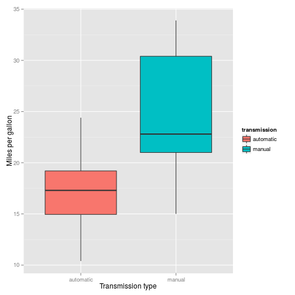
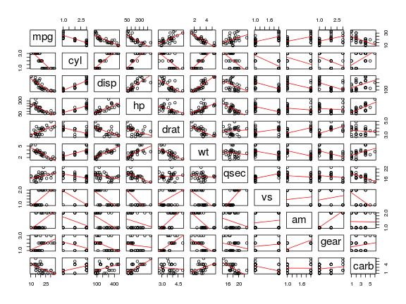
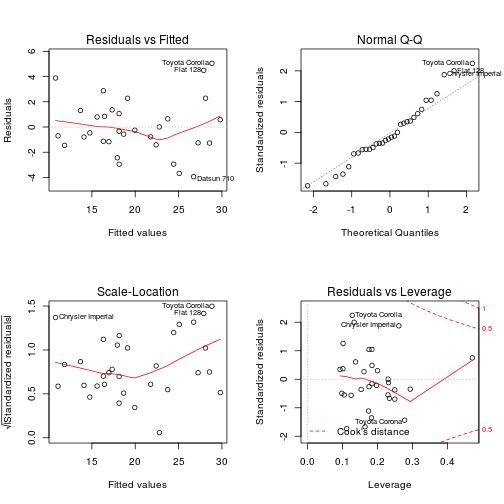

# Introduction
One of the greatest debate about cars is on the transmission type. While
the manual transmission is on its way towards extinction in the US, they are
[still very popular in Europe](http://www.dctfacts.com/archive/2008/why-dual-clutch-technology-big-business.aspx).
One often stated advantage of manual
transmission over automatic one is the fuel efficiency. The purpose of
this analysis is to find if there is any relationship between a set of
variables and miles per gallon (MPG). Is it worth learning how to drive
stick shift or buy one despite the challenging stop-and-go on hills?

# Data analysis

`mtcars` dataset was used for the analysis. It comprises fuel consumption
and 10 aspects of automobile design and performance for 32 automobiles
(1973-1974).


```r
# factor some variables
mtcars$cyl <- factor(mtcars$cyl)
mtcars$vs <- factor(mtcars$vs)
mtcars$am <- factor(mtcars$am)
mtcars$gear <- factor(mtcars$gear)
mtcars$carb <- factor(mtcars$carb)
str(mtcars)
```

```
## 'data.frame':	32 obs. of  11 variables:
##  $ mpg : num  21 21 22.8 21.4 18.7 18.1 14.3 24.4 22.8 19.2 ...
##  $ cyl : Factor w/ 3 levels "4","6","8": 2 2 1 2 3 2 3 1 1 2 ...
##  $ disp: num  160 160 108 258 360 ...
##  $ hp  : num  110 110 93 110 175 105 245 62 95 123 ...
##  $ drat: num  3.9 3.9 3.85 3.08 3.15 2.76 3.21 3.69 3.92 3.92 ...
##  $ wt  : num  2.62 2.88 2.32 3.21 3.44 ...
##  $ qsec: num  16.5 17 18.6 19.4 17 ...
##  $ vs  : Factor w/ 2 levels "0","1": 1 1 2 2 1 2 1 2 2 2 ...
##  $ am  : Factor w/ 2 levels "0","1": 2 2 2 1 1 1 1 1 1 1 ...
##  $ gear: Factor w/ 3 levels "3","4","5": 2 2 2 1 1 1 1 2 2 2 ...
##  $ carb: Factor w/ 6 levels "1","2","3","4",..: 4 4 1 1 2 1 4 2 2 4 ...
```

The following boxplot shows the relation between the transmission type
and the MPG.


```r
library(plyr)
library(ggplot2)
# Rename the levels of transmission types
transmission <- revalue(mtcars$am, c('0'="automatic", '1'="manual"))
ggplot(mtcars, aes(x=transmission, y=mpg, fill=transmission)) +
    geom_boxplot() +
    xlab("Transmission type") +
    ylab("Miles per gallon")
```

 

It suggests a clear difference on fuel consumption between automatic
and manual transmission cars. Below is the model to explain the MPG
variability with the transmission type _only_.


```r
fit1 <- lm(mpg ~ am, data=mtcars)
summary(fit1)
```

```
## 
## Call:
## lm(formula = mpg ~ am, data = mtcars)
## 
## Residuals:
##    Min     1Q Median     3Q    Max 
## -9.392 -3.092 -0.297  3.244  9.508 
## 
## Coefficients:
##             Estimate Std. Error t value Pr(>|t|)    
## (Intercept)    17.15       1.12   15.25  1.1e-15 ***
## am1             7.24       1.76    4.11  0.00029 ***
## ---
## Signif. codes:  0 '***' 0.001 '**' 0.01 '*' 0.05 '.' 0.1 ' ' 1
## 
## Residual standard error: 4.9 on 30 degrees of freedom
## Multiple R-squared:  0.36,	Adjusted R-squared:  0.338 
## F-statistic: 16.9 on 1 and 30 DF,  p-value: 0.000285
```

Although coefficients for both intercept and the transmission type are
significant, the model fit using _only_ transmission type explains only
35.9799% of the MPG variation.


Before making any conclusions on the effect of transmission type on fuel
efficiency, we look at the variances between several variables in the dataset.


```r
pairs(mtcars, panel=function(x,y) {
    points(x, y)
    abline(lm(y ~ x), col="red")
})
```

 

Based on the pairs plot above, several variables seem to have high
correlation with the `mpg` variable. Hence, we build an initial model
using all variables and select the model with the best subset of
predictors using stepwise backward elimination and forward selection.


```r
initial_model <- lm(mpg ~ ., data=mtcars)
best_model <- step(initial_model, direction="both", trace=0)
summary(best_model)
```

```
## 
## Call:
## lm(formula = mpg ~ cyl + hp + wt + am, data = mtcars)
## 
## Residuals:
##    Min     1Q Median     3Q    Max 
## -3.939 -1.256 -0.401  1.125  5.051 
## 
## Coefficients:
##             Estimate Std. Error t value Pr(>|t|)    
## (Intercept)  33.7083     2.6049   12.94  7.7e-13 ***
## cyl6         -3.0313     1.4073   -2.15   0.0407 *  
## cyl8         -2.1637     2.2843   -0.95   0.3523    
## hp           -0.0321     0.0137   -2.35   0.0269 *  
## wt           -2.4968     0.8856   -2.82   0.0091 ** 
## am1           1.8092     1.3963    1.30   0.2065    
## ---
## Signif. codes:  0 '***' 0.001 '**' 0.01 '*' 0.05 '.' 0.1 ' ' 1
## 
## Residual standard error: 2.41 on 26 degrees of freedom
## Multiple R-squared:  0.866,	Adjusted R-squared:  0.84 
## F-statistic: 33.6 on 5 and 26 DF,  p-value: 1.51e-10
```

```r
par(mfrow = c(2,2))
plot(best_model)
```

 

The final model contains four predictors, `cyl` (number of cylinders),
`hp` (horsepower), `weight` (weight) and `am` (transmission type). This
model explains the 86.588% of the MPG
variation. The number of cylinders, weight and horsepower  significantly
contribute to the accuracy of the model while the transmission has no effect
on the fuel consumption ($\alpha=0.05$). Also the residual plots show that
the distribution of residuals seem to be
normally distributed and not depending on fitted values.

# Results

The data analysis on `mtcars` dataset from 1973 reveals some interesting
points.

- If a car has 6 cylinder or 8 cylinder, rather than 4, the fuel consumption
increases by 3.0313 and
2.1637 MPG, respectively.
- One unit of increase on gross horsepower results
0.0321 less MPG, an increase on the fuel
consumption.
- 1000 lb increase on the weight of a car, everything else same, yields
2.4968 less MPG, again an increase on the
fuel consumption.

The `mtcars` dataset used for this analysis comprises data for 1973-1974
models. This analysis was not able to find any significant link between the
transmission type and fuel consumption. For modern cars, with much more
efficient automatic transmission system, it is less likely that having
a stick shift car will save you any money.
